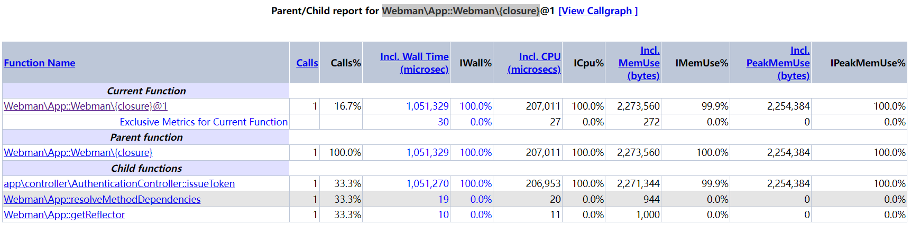

# 简介

[XHProf](https://www.php.net/manual/zh/intro.xhprof.php) 是一个分层PHP性能分析工具。它报告函数级别的请求次数和各种指标，包括阻塞时间，CPU时间和内存使用情况。一个函数的开销，可细分成调用者和被调用者的开销，XHProf数据收集阶段，它记录调用次数的追踪和包容性的指标弧在动态callgraph的一个程序。它独有的数据计算的报告/后处理阶段。

在数据收集时，XHProfd通过检测循环来处理递归的函数调用，并通过给递归调用中每个深度的调用一个有用的命名来避开死循环。XHProf分析报告有助于理解被执行的代码的结构，它有一个简单的HTML的用户界面（ PHP写成的）。基于浏览器的性能分析用户界面能更容易查看，或是与同行们分享成果。也能绘制调用关系图。

# 安装

```php
composer require tinywan/webman-xhprof
```

# [XHProf](https://www.php.net/manual/zh/intro.xhprof.php) 安装

下载
```javascript
wget https://pecl.php.net/get/xhprof-2.3.9.tgz
tar -zxvf xhprof-2.3.9.tgz
cd ./xhprof-2.3.9/extension
phpize
./configure --with-php-config=/usr/local/php-7.4/bin/php-config
make
make install
```

`php.ini` 配置

```php
[xhprof]
extension=xhprof.so;
xhprof.output_dir=/tmp/xhprof;
```

确认是否安装成功

```javascript
/var/www # php --ri xhprof

xhprof

xhprof support => enabled
Version => 2.3.9
```
# 使用

配置 `config/middleware.php`

```php
return [
    '' => [
        \Tinywan\Xhprof\XhprofMiddleware::class,
    ]
];
```

# 查看

访问地址 `http://webman.xhprof.com/xhprof/xhprof_html/index.php`

> Existing runs


> Webman\App::Webman\{closure}



> 图形化展示


# 其他

```shell
Function Name：方法名称。
Calls：方法被调用的次数。
Calls%：方法调用次数在同级方法总数调用次数中所占的百分比。
Incl.Wall Time(microsec)：方法执行花费的时间，包括子方法的执行时间。（单位：微秒）
IWall%：方法执行花费的时间百分比。
Excl. Wall Time(microsec)：方法本身执行花费的时间，不包括子方法的执行时间。（单位：微秒）
EWall%：方法本身执行花费的时间百分比。
Incl. CPU(microsecs)：方法执行花费的CPU时间，包括子方法的执行时间。（单位：微秒）
ICpu%：方法执行花费的CPU时间百分比。
Excl. CPU(microsec)：方法本身执行花费的CPU时间，不包括子方法的执行时间。（单位：微秒）
ECPU%：方法本身执行花费的CPU时间百分比。
Incl.MemUse(bytes)：方法执行占用的内存，包括子方法执行占用的内存。（单位：字节）
IMemUse%：方法执行占用的内存百分比。
Excl.MemUse(bytes)：方法本身执行占用的内存，不包括子方法执行占用的内存。（单位：字节）
EMemUse%：方法本身执行占用的内存百分比。
Incl.PeakMemUse(bytes)：Incl.MemUse峰值。（单位：字节）
IPeakMemUse%：Incl.MemUse峰值百分比。
Excl.PeakMemUse(bytes)：Excl.MemUse峰值。单位：（字节）
EPeakMemUse%：Excl.MemUse峰值百分比。
```